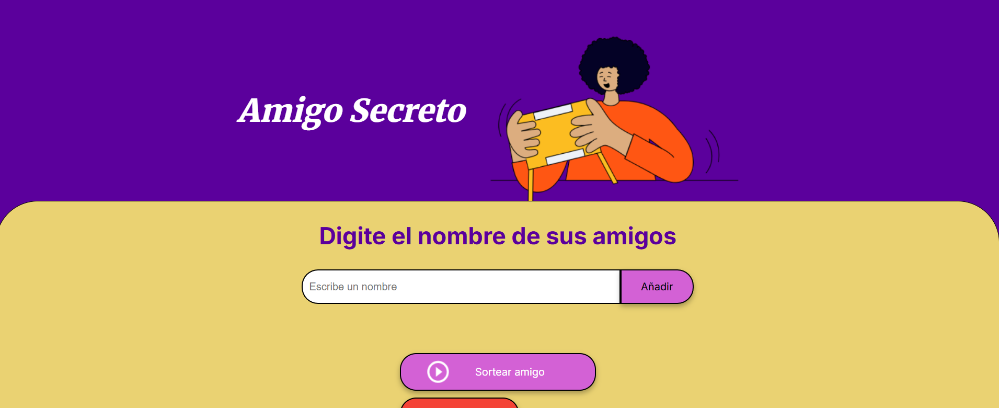

# Challenge-amigo-secreto

## Descripción

Este proyecto es una aplicación web interactiva para jugar al **Amigo Secreto**. Los usuarios pueden agregar nombres de amigos a una lista y luego realizar un sorteo aleatorio para asignar a cada persona un "amigo secreto". La aplicación también permite reiniciar el sorteo y ver los resultados.

### Funciones principales:

- **Agregar amigos**: Los usuarios pueden ingresar nombres y añadirlos a la lista de amigos.
- **Sorteo aleatorio**: Elige un amigo aleatoriamente de la lista y lo muestra como el "amigo secreto".
- **Reinicio**: Permite reiniciar el sorteo y borrar la lista de amigos y resultados.

## Tecnologías usadas

- **HTML5**: Estructura y contenido de la página.
- **CSS3**: Diseño y estilos responsivos.
- **JavaScript**: Lógica para agregar amigos, realizar el sorteo y reiniciar la aplicación.

## Instrucciones

1. Clona este repositorio en tu máquina local.
2. Abre el archivo `index.html` en tu navegador para ver la aplicación en acción.
3. Ingresa los nombres de tus amigos y haz clic en el botón "Añadir".
4. Una vez que hayas agregado todos los amigos, haz clic en "Sortear amigo" para ver quién es tu amigo secreto.
5. Si deseas reiniciar el sorteo, haz clic en "Reiniciar Sorteo".

## Instalación

No es necesario ningún entorno de desarrollo especial. Solo necesitas un navegador web para ejecutar el archivo `index.html`.

1. Clona el repositorio:

   ```bash
   git clone https://github.com/tu-usuario/challenge-amigo-secreto.git
2. Navega hasta la carpeta del proyecto:

   ```bash
   cd challenge-amigo-secreto

Abre el archivo index.html en tu navegador.

### Vista previa de la aplicación:


